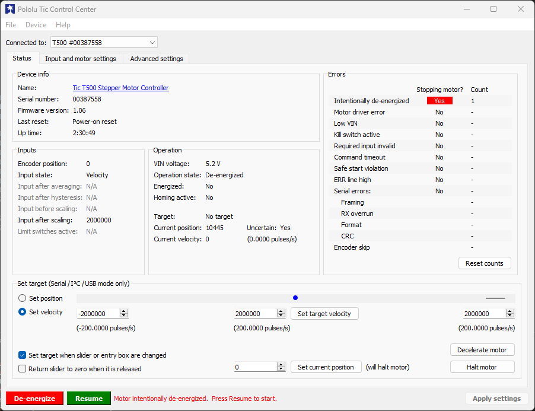
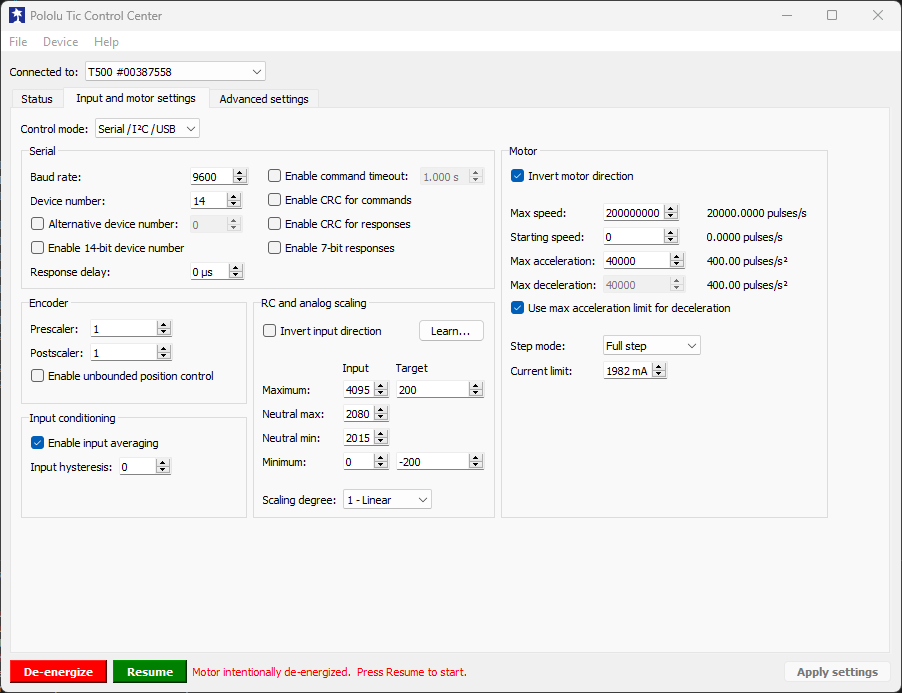
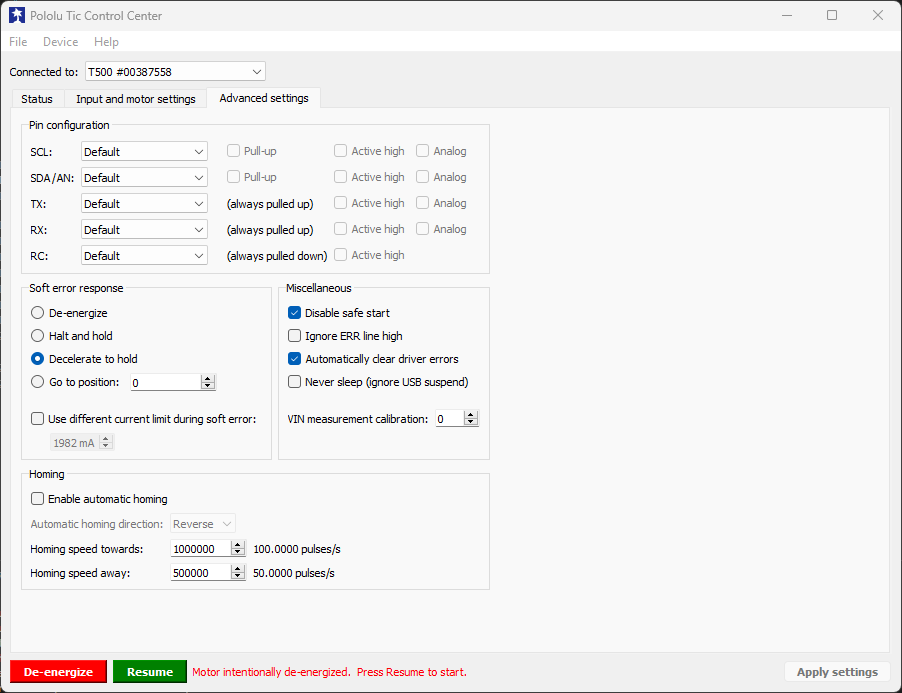
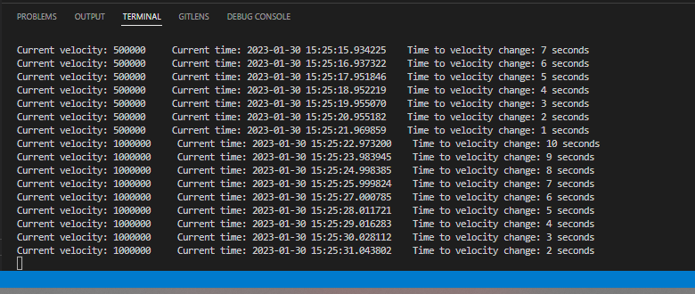
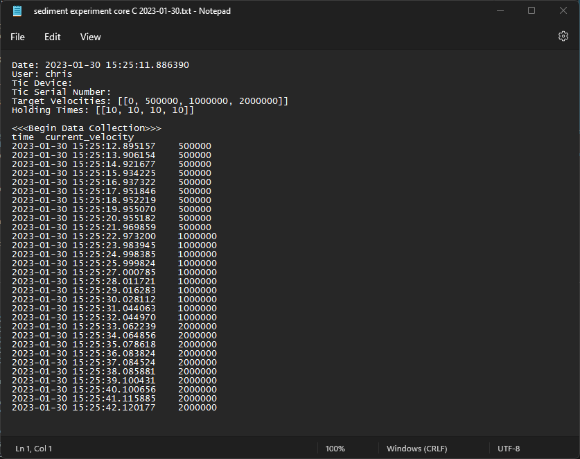

# Polulu Tic Automated Incremental Change in Target Velocity
Script that automates incremental increases in velocity based on user inputs. This program builds upon scripts in the [Pololu-Tic-Software Github](https://github.com/pololu/pololu-tic-software) and [ticlib Github](https://github.com/jphalip/ticlib).

# Prerequisites
Requires [Tic Software and Drivers for Windows](https://www.pololu.com/file/0J1325/pololu-tic-1.8.2-win.msi) provided by Pololu to be installed. Also requires installation of [ticlib Python wrapper](https://github.com/jphalip/ticlib). Navigate to the directory containing the repo and install the dependencies using the following command:

```
pip install -r requirements.txt
```
# Script Use
## 1. Update Settings via Pololu Tic Control Center
Before running [autoTic.py](autoTic.py), open the Pololu Tic Control Center on the desktop. Navigate through the tabs and update the settings according to the product being used. For more details on settings and recommendations for given products, see the [Pololu Tic Manual](https://www.pololu.com/docs/0J71), Section 6 Setting Reference.

<p align="center">
  
   
  
</p>

After making any changes, make sure to click "Apply Settings" in the lower right-hand corner of the screen.

## 2. Preparing Run Parameters
The [autoTic.py](autoTic.py) allows the user to either import run parameters or manually enter them through the command line. After requesting a core ID, the script will prompt the user to select whether to import parameters or enter them into the command line:

```
> Import run parameters (I) or enter manually (M)? Enter I or M.
```
See below sections on guidance for both options.
### <u>Import Run Parameters (Option A)</u>
Update the [run_parameters.csv](run_parameters.csv) with desired target velocities and holding times. Keep in mind the maximum speed of the controller when selecting target velocities.
* <b>target_velocities</b>: desired speed of the impeller in microsteps per 10,0000 seconds.
* <b>holding_time</b>: the amount of time in seconds the user wants the impellar to maintain the target velocity.

The script will proceed through the velocities and holding steps by row order.

### <u>Manually Enter Run Parameters (Option B)</u>
If the user wants to run the impellar on the fly without updating import documents, enter M at the prompt.

```
> Enter target velocities (microsteps/ 10,000 seconds):
> Please enter a list separated by a space
```
Below is an example input:
```
50000 100000 150000 20000
```
The script will then ask for holding times for each target velocity.
```
Holding times for target velocities (secs):
Please enter a list separated by a space
```
Below is an example input:
```
10 10 10 10
```
<b>Make sure that the length of the target velocities list matches the length of the holding times list.</b> Otherwise, this will cause a script error downstream.

## 3. Executing Run
After confirming run parameters are correct, the script will ask if the user is ready to begin the run.
```
Begin run? Y/N
```
After inputing `Y`, the script will start modifying the target velocities in accordance with the chosen run parameters. Note that pressing `Ctrl + C` at any time will shutdown the motor and exit the program.

As the program runs, the current velocity, current time, and time until change in velocity will print to the console.



Simutaneously, the time and associated velocities will be written to a newly generated .txt file "sediment experiment core [user input] [current date]", with the variables depending on the current date and user input.

## 4. Shutdown
Once the holding time ends for the last specified velocity, the impellar will continue to run at the last velocity and a new prompt will ask the user if they want to shutdown the motor.
```
> Stop Motor? Y/N
```
Entering Y will shutdown the motor and exit the program. Again, note that pressing `Ctrl + C` at any time will shutdown the motor and exit the program.

The generated .txt file should look similar to the [example](sediment%20experiment%20core%20C%202023-01-30.txt) file in this repo:



# External Resources
- [logging Library](https://docs.python.org/3/library/logging.html)
- [Pololu-Tic-Software Github](https://github.com/pololu/pololu-tic-software)
- [Pololu Tic Manual](https://www.pololu.com/docs/0J71)
- [Pololu Tic Resources](https://www.pololu.com/product/3131/resources)
- [ticlib Github](https://github.com/jphalip/ticlib)
- [tic.h](https://github.com/pololu/pololu-tic-software/blob/master/include/tic.h)
- [tic_protocol.h](https://github.com/pololu/pololu-tic-software/blob/a75c204a2255554e21cc5351c528d930ba5d2c38/include/tic_protocol.h)
- [Tic Software and Drivers for Windows](https://www.pololu.com/file/0J1325/pololu-tic-1.6.2-win.msi)
